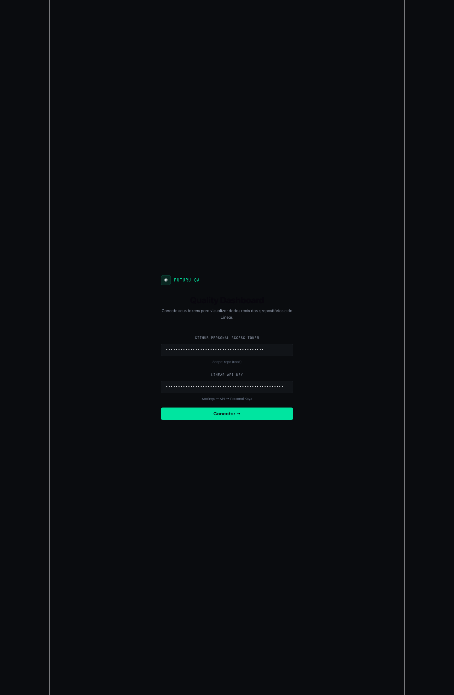
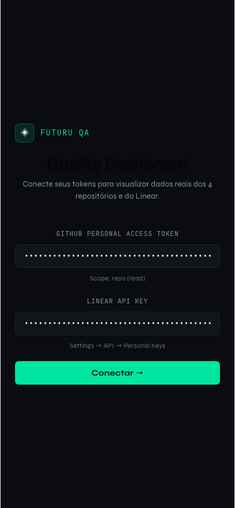
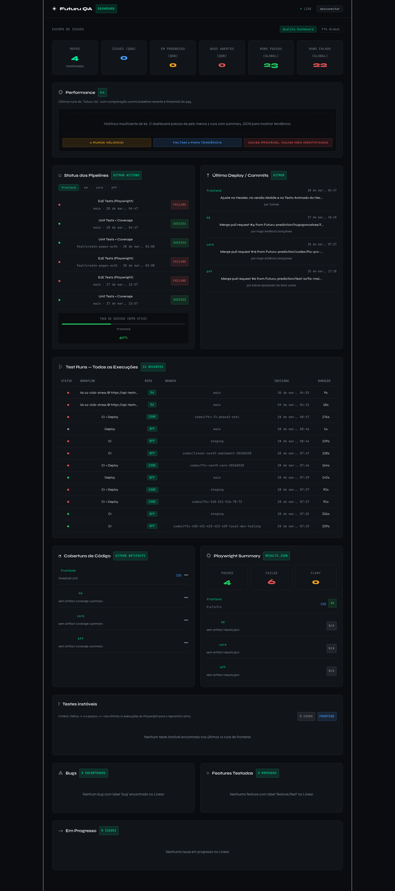
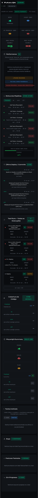
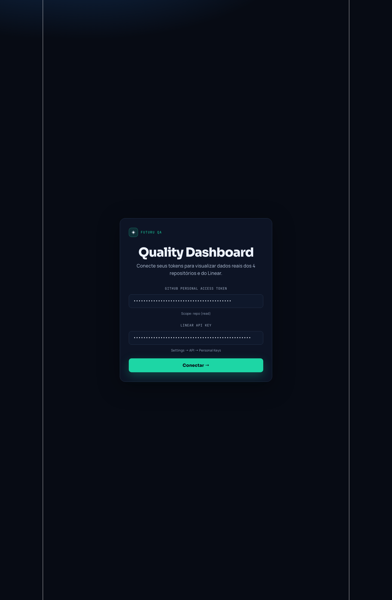
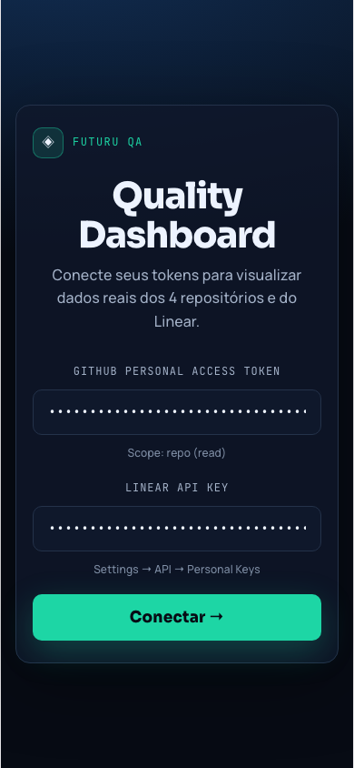
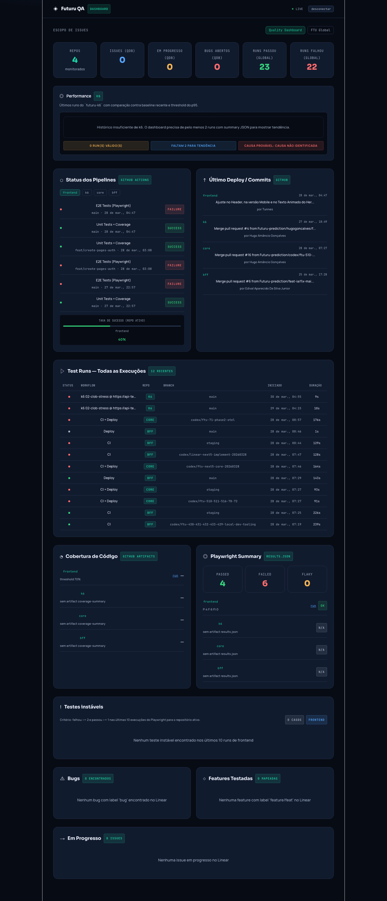
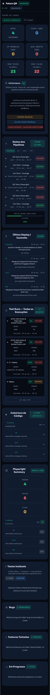

# Auditoria UX/UI — Quality Dashboard

Data: 2026-03-30  
Projeto publicado: https://quality-dashboard-three.vercel.app/

## Escopo
- Tela de entrada (login de tokens)
- Dashboard interno (após conexão)
- Visões desktop e mobile

## Prints — Estado Atual (Deploy em produção)

### Login
Desktop (atual):

Mobile (atual):

### Dashboard
Desktop (atual):

Mobile (atual):

## Prints — Proposta UX/UI (versão ajustada)

### Login
Desktop (proposta):

Mobile (proposta):

### Dashboard
Desktop (proposta):

Mobile (proposta):

## Diagnóstico UX/UI

1. Tipografia estava com baixa hierarquia (muitos textos em 10-13px), dificultando escaneabilidade.
2. Contraste geral da home de login estava baixo e a área principal parecia “perdida” no canvas.
3. Alinhamento visual da entrada não conduzia foco (bloco pequeno, sem camada de superfície clara).
4. Cartões do dashboard estavam com densidade alta e leitura numérica comprimida.
5. Componentes interativos (inputs/botões/toggles) tinham feedback visual discreto no foco e clique.

## Melhorias propostas

### 1) Letras e fontes
- Base de interface: `Manrope` (legibilidade).
- Headings e números de destaque: `Sora` (hierarquia).
- Labels técnicos: `JetBrains Mono`.
- Escala de texto elevada em labels, subtítulos e números de KPIs.

### 2) Cores
- Fundo: `#070B14` com gradiente radial de profundidade.
- Superfícies/cartões: `#111B2E`.
- Bordas: `#24324A` (e hover `#314764`).
- Texto primário: `#EDF3FF`; secundário: `#A4B2C8`.
- Cor de ação principal: `#1DD6A5`.

### 3) Tamanhos
- Login card: largura máxima de `560px` com padding maior.
- Inputs: fonte `15px` e altura visual maior (`padding` ampliado).
- CTA: 16/17px, peso maior, com sombra e raio ampliado.
- KPIs: número principal em `30px` e labels em `12px`.

### 4) Alinhamento e espaçamento
- Login convertido em card com superfície dedicada, borda e sombra.
- Espaçamento horizontal do dashboard ampliado (desktop/tablet/mobile).
- Maior separação entre seções e blocos de métricas.
- Header com leitura mais forte e contraste superior.

## Implementação aplicada no projeto

Arquivos alterados:
- `src/App.jsx`
- `src/components/K6PerformanceSection.jsx`

Principais pontos de código:
- Novo sistema visual (tokens de cor e tipografia) em `COLORS`.
- Nova importação de fontes no CSS injetado.
- Refino de componentes base (`Tag`, `Stat`, `SectionHeader`, `Card`, `EmptyState`).
- Redesign da tela de login com card central e estados de foco reforçados.
- Ajuste de paddings/gaps no dashboard para maior consistência visual.

## Lista de arquivos gerados
- `output/playwright/ux-ui-refresh/current/desktop-login.png`
- `output/playwright/ux-ui-refresh/current/mobile-login.png`
- `output/playwright/ux-ui-refresh/current/desktop-dashboard.png`
- `output/playwright/ux-ui-refresh/current/mobile-dashboard.png`
- `output/playwright/ux-ui-refresh/proposed/desktop-login.png`
- `output/playwright/ux-ui-refresh/proposed/mobile-login.png`
- `output/playwright/ux-ui-refresh/proposed/desktop-dashboard.png`
- `output/playwright/ux-ui-refresh/proposed/mobile-dashboard.png`
- `docs/qa/ux-ui-auditoria-proposta-2026-03-30.md`
